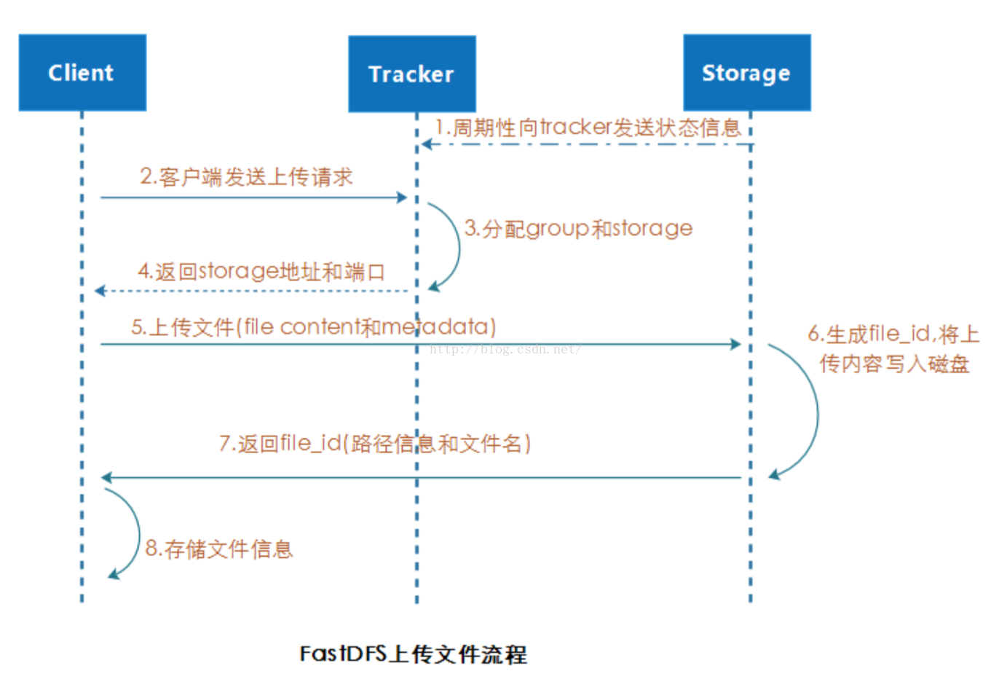
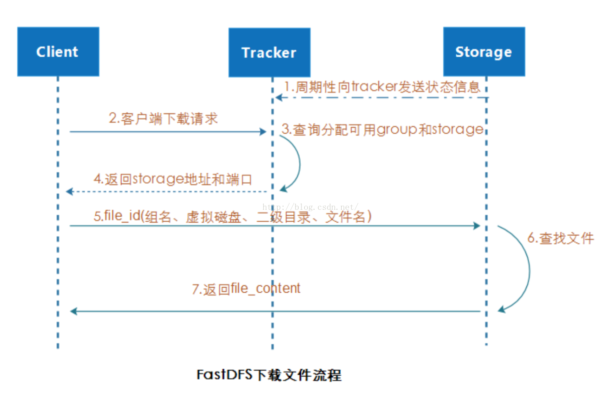

# FastDFS

## 1. 概述

该架构包括Tracker server(跟踪器)和Storage server(存储节点)。客户端请求tracker,通过tracker调度最终由storage完成文件上传和下载

### tracker

tracker主要负责调度工作，在访问上起负载均衡的作用。跟踪器Tracker负责管理所有的Storage和group，每个Storage在启动后会连接Tracker，告知自己所属的group等信息，并保持周期性的心跳，tracker根据storage的心跳信息，建立group==>[storage server list]的映射表，Tracker需要管理的元信息很少，会全部存储在内存中；另外tracker上的元信息都是由storage汇报的信息生成的，本身不需要持久化任何数据，这样使得tracker非常容易扩展，直接增加tracker机器即可扩展为tracker cluster来服务，cluster里每个tracker之间是完全对等的，所有的tracker都接受stroage的心跳信息，生成元数据信息来提供读写服务。

### storage

存储节点Storage采用了分组[group]的组织方式，存储系统由一个或多个组组成，组与组之间的文件是相互独立的，所有组的文件容量累加就是整个存储系统中的文件容量。 一个组[group]可以由一台或多台存储服务器组成，一个组中的存储服务器中的文件都是相同的，组中的多台存储服务器起到了冗余备份和负载均衡的作用，数据互为备份，存储空间以group内容量最小的storage为准，所以建议group内的多个storage尽量配置相同，以免造成存储空间的浪费。

## 2.安装

1.安装操作系统包

```
yum install unzip zip gcc-c++
```

2.libfastcommon包安装

```
FastDFS 将以前版本的公共的一些函数单独封装成了libfastcommon包，所以在安装FastDFS之前我们还必须安装libfastcommon。

2.1解压
unzip libfastcommon-master.zip
2.2编译
./make.sh
2.3安装
./make.sh install
改包默认装到了/usr/lib64/libfastcommon.so，但是FastDFS主程序设置的lib目录是/usr/local/lib，所以需要重新设置软连接(类似于快捷方式):
ln -s /usr/lib64/libfastcommon.so /usr/local/lib/libfastcommon.so
ln -s /usr/lib64/libfdfsclient.so /usr/local/lib/libfdfsclient.so
ln -s /usr/lib64/libfdfsclient.so /usr/lib/libfdfsclient.so
```

3.fastDFS安装

```
unzip fastdfs-master.zip
cd fastdfs-master
./make.sh
./make.sh install

cd /etc/fdfs/
ll -lh

对三个配置文件进行拷贝，后面有用
cp client.conf.sample client.conf
cp storage.conf.sample storage.conf
cp tracker.conf.sample tracker.conf
```

3.1tracker安装

```
创建Tracker服务器的文件路径，即用于存储Tracker的数据文件和日志文件等：
mkdir /opt/fastdfs_tracker

编辑/etc/fdfs/tracker.conf配置文件，打开文件后依次做以下修改
    vim /etc/fdfs/tracker.conf 
    #启用配置文件（默认false）
    disabled=false 

    #设置tracker的端口号，通常采用22122这个默认端口
    port=22122

    #设置tracker的数据文件和日志目录
    base_path=/opt/fastdfs_tracker 

    #设置http端口号，初始值为8080
    http.server_port=6666 

为启动脚本创建软引用，因为fdfs_trackerd等命令在/usr/local/bin中并没有，而是在/usr/bin路径下：
ln -s /usr/bin/fdfs_trackerd  /usr/local/bin
ln -s /usr/bin/stop.sh  /usr/local/bin
ln -s /usr/bin/restart.sh  /usr/local/bin

最后通过命令启动Tracker服务器：
service fdfs_trackerd start

如果启动命令执行成功，那么同时在刚才创建的tracker文件目录/opt/fastdfs_tracker中就可以看到启动后新生成的data和logs目录，tracker服务的端口也应当被正常监听，最后再通过netstat命令查看一下端口监听情况：
netstat -unltp|grep fdfs
```

3.2storage安装

```
创建Storage服务器的文件目录，**注意同Tracker相比要多建一个目录**，因为Storage还需要一个文件存储路径，用于存放接收的文件：
mkdir /opt/fastdfs_storage
mkdir /opt/fastdfs_storage_data

接下来修改/etc/fdfs/storage.conf配置文件，打开文件后依次做以下修改：
#设置storage端口号，默认是23000，同一个组的storage端口号必须一致
port=23000
#设置storage数据文件和日志目录
base_path=/opt/fastdfs_storage 
#实际文件存储路径
store_path0=/opt/fastdfs_storage_data 

#存储路径个数，需要和store_path个数匹配
store_path_count=1 

#tracker 服务器的 IP地址和端口号，如果是单机搭建，IP不要写127.0.0.1，否则启动不成功
tracker_server=117.27.1.11:22122 
#设置 http 端口号
http.server_port=8888

配置完成后同样要为Storage服务器的启动脚本设置软引用：
ln -s /usr/bin/fdfs_storaged /usr/local/bin

接下来就可以启动Storage服务了：
service fdfs_storaged start

验证成功启动的方法：

netstat -unltp|grep fdfs
查看是否有23000，22122，两个端口在
成功的话，/opt/fastdfs_storage/data目录下生成好的文件夹，data下有256个1级目录，每级目录下又有256个2级子目录，总共65536个文件夹。
新写的文件会以hash的方式被路由到其中某个子目录下，然后将文件数据直接作为一个本地文件存储到该目录中。那么最后我们再看一下storage服务的端口监听情况： 

查看：storage服务器是否已经登记到 tracker服务器，运行以下命令：
/usr/bin/fdfs_monitor /etc/fdfs/storage.conf

看到117.27.1.11 ACTIVE 字样即可说明storage服务器已经成功登记到了tracker服务器
```

4.fastdfs-nginx-module

```
fastDFS目前已不支持http协议,提供了nginx上使用FastDFS的模块fastdfs-nginx-module，这样做最大的好处就是提供了HTTP服务并且解决了group中storage服务器的同步延迟问题
安nginx模块依赖lib库
yum -y install pcre pcre-devel  
yum -y install zlib zlib-devel  
yum -y install openssl openssl-devel


前提需要先安装好nginx

https://github.com/happyfish100/fastdfs-nginx-module
进入源码nginx安装文件夹
解压成功后就可以编译安装nginx了，进入nginx目录并输入以下命令进行配置：
./configure --prefix=/usr/local/nginx  --add-module=/opt/dfspackages/fastdfs-nginx-module-master/src 
make
make install

或则是全新安装NGINX
./configure --prefix=/opt/dfsNginx  --user=nginx --group=nginx --with-http_ssl_module --with-http_flv_module --with-http_gzip_static_module  --with-http_stub_status_module  --add-module=/opt/dfspackages/fastdfs-nginx-module-master/src  --http-client-body-temp-path=/var/tmp/nginx/proxy --http-fastcgi-temp-path=/var/tmp/nginx/fcgi
make && make install
groupadd -f nginx
 useradd -g nginx nginx

配置nginx.conf文件，加入server{ }中
listen       9999;

location ~/group1/M00 {
      root /opt/fastdfs_storage_data/data;
      ngx_fastdfs_module;
}
cp /opt/dfspackages/fastdfs-master/conf/http.conf      /etc/fdfs/
cp /opt/dfspackages/fastdfs-master/conf/mime.types  /etc/fdfs/
cp /opt/dfspackages/fastdfs-nginx-module-master/src/mod_fastdfs.conf  /etc/fdfs/


编辑mod_fastdfs.conf文件,vim /etc/fdfs/mod_fastdfs.conf：
#保存日志目录
base_path=/opt/fastdfs_storage 

#tracker服务器的IP地址以及端口号
tracker_server=192.168.111.11:22122 

#storage服务器的端口号
storage_server_port=23000 

#文件 url 中是否有 group 名
url_have_group_name = true 
# 存储路径
store_path0=/opt/fastdfs_storage_data 
#设置组的个数，事实上这次只使用了group1
group_count = 3 


设置了group_count = 3，接下来就需要在文件尾部追加这3个group setting：
[group1]
group_name=group1
storage_server_port=23000
store_path_count=1
store_path0=/opt/fastdfs_storage_data

[group2]
group_name=group2
storage_server_port=23000
store_path_count=1
store_path0=/opt/fastdfs_storage_data

[group3]
group_name=group3
storage_server_port=23000
store_path_count=1
store_path0=/opt/fastdfs_storage_data

接下来还需要建立 M00 至存储目录的符号连接：
ln  -s  /opt/fastdfs_storage_data/data  /opt/fastdfs_storage_data/data/00

最后启动nginx：
/usr/local/nginx/sbin/nginx

浏览器也可以看到nginx的主页
```

## 3.关键字

#### 1:组名

文件上传后所在的storage组名称在文件上传成功后storage服务器返回，需要客户端自行保存

#### 2:虚拟磁盘路径

storage配置的虚拟路径，5与磁盘选项store_path*对应。如果配置了store_path0则是M00，如果配置了store_path1则是M01，以此类推。

#### 3:数据两级目录

storage服务器在每个虚拟磁盘路径下创建的两级目录，用于存储数据文件。

#### 4:文件名

与文件上传时不同。是由存储服务器根据特定信息生成，文件名包含：源存储服务器IP地址、文件创建时间戳、文件大小、随机数和文件拓展名等信息。

客户端上传文件后存储服务器将file_ID返回给客户端，此ID用于以后访问该文件的索引信息。文件索引信息包括：组名、虚拟磁盘路径、数据两级目录、文件名

文件上传流程： 

文件下载流程：  

storage server的7种状态:
INIT : 初始化,尚未得到同步已有数据的源服务器
WAIT_SYNC : 等待同步,已得到同步已有数据的源服务器
SYNCING : 同步中
DELETED : 已删除,该服务器从本组中摘除
OFFLINE :离线
ONLINE : 在线,尚不能提供服务
ACTIVE : 在线,可以提供服务
通过命令 fdfs_monitor /etc/fdfs/client.conf 可以查看
ip_addr选项显示 storage server 当前状态

## 4.上传

### 4.1上传文件:

```
fastDFS向使用者提供基本文件访问接口,如upload、download、append、delete等,以客户端的方式提供给用户使用

当集群中不止一个tracker时，由于tracker之间完全对等，客户端在upload文件时可以任意选择一个tracker

当tracker接受到upload file请求时,会为该文件分配一个可以存储该文件的group,支持如下选择group的规则： 1. Round robin，所有的group间轮询 2. Specified group，指定某一个确定的group 3. Load balance，剩余存储空间多多group优先

当选定group后，tracker会在group内选择一个storage server给客户端，支持如下选择storage的规则： 1. Round robin，在group内的所有storage间轮询 2. First server ordered by ip，按ip排序 3. First server ordered by priority，按优先级排序（优先级在storage上配置）

当分配好storage server后，客户端将向storage发送写文件请求，storage将会为文件分配一个数据存储目录，支持如下规则： 1. Round robin，多个存储目录间轮询 2. 剩余存储空间最多的优先

选定存储目录之后，storage会为文件生一个Fileid，由storage server ip、文件创建时间、文件大小、文件crc32和一个随机数拼接而成，然后将这个二进制串进行base64编码，转换为可打印的字符串。

当选定存储目录之后，storage会为文件分配一个fileid，每个存储目录下有两级256*256的子目录，storage会按文件fileid进行两次hash（猜测），路由到其中一个子目录，然后将文件以fileid为文件名存储到该子目录下。

当文件存储到某个子目录后，即认为该文件存储成功，接下来会为该文件生成一个文件名，文件名由group、存储目录、两级子目录、fileid、文件后缀名（由客户端指定，主要用于区分文件类型）拼接而成。
```

### 4.1文件同步：

```
 写文件时，客户端将文件写至group内一个storage server即认为写文件成功，storage server写完文件后，会由后台线程将文件同步至同group内其他的storage server。

每个storage写文件后，同时会写一份binlog，binlog里不包含文件数据，只包含文件名等元信息，这份binlog用于后台同步，storage会记录向group内其他storage同步的进度，以便重启后能接上次的进度继续同步；进度以时间戳的方式进行记录，所以最好能保证集群内所有server的时钟保持同步。

storage的同步进度会作为元数据的一部分汇报到tracker上，tracke在选择读storage的时候会以同步进度作为参考。

比如一个group内有A、B、C三个storage server，A向C同步到进度为T1 (T1以前写的文件都已经同步到B上了），B向C同步到时间戳为T2（T2 > T1)，tracker接收到这些同步进度信息时，就会进行整理，将最小的那个做为C的同步时间戳，本例中T1即为C的同步时间戳为T1（即所有T1以前写的数据都已经同步到C上了）；同理，根据上述规则，tracker会为A、B生成一个同步时间戳。
```

## 5.下载

### 5.1下载文件

```
客户端upload file成功后，会拿到一个storage生成的文件名，接下来客户端根据这个文件名即可访问到该文件。

 跟upload file一样，在download file时客户端可以选择任意tracker server。

tracker发送download请求给某个tracker，必须带上文件名信息，tracke从文件名中解析出文件的group、大小、创建时间等信息，然后为该请求选择一个storage用来服务读请求。由于group内的文件同步时在后台异步进行的，所以有可能出现在读到时候，文件还没有同步到某些storage server上，为了尽量避免访问到这样的storage，tracker按照如下规则选择group内可读的storage。

1. 该文件上传到的源头storage - 源头storage只要存活着，肯定包含这个文件，源头的地址被编码在文件名中。 2. 文件创建时间戳==storage被同步到的时间戳 且(当前时间-文件创建时间戳) > 文件同步最大时间（如5分钟) - 文件创建后，认为经过最大同步时间后，肯定已经同步到其他storage了。 3. 文件创建时间戳 < storage被同步到的时间戳。 - 同步时间戳之前的文件确定已经同步了 4. (当前时间-文件创建时间戳) > 同步延迟阀值（如一天）。 - 经过同步延迟阈值时间，认为文件肯定已经同步了。
```

小文件合并存储

```
小文件合并存储主要解决如下几个问题:
1. 本地文件系统inode数量有限，从而存储的小文件数量也就受到限制。 2. 多级目录+目录里很多文件，导致访问文件的开销很大（可能导致很多次IO） 3. 按小文件存储，备份与恢复的效率低

 FastDFS在V3.0版本里引入小文件合并存储的机制，可将多个小文件存储到一个大的文件（trunk file），为了支持这个机制，FastDFS生成的文件fileid需要额外增加16个字节

1. trunk file id 
2. 文件在trunk file内部的offset 
3. 文件占用的存储空间大小 （字节对齐及删除空间复用，文件占用存储空间>=文件大小）

每个trunk file由一个id唯一标识，trunk file由group内的trunk server负责创建（trunk server是tracker选出来的），并同步到group内其他的storage，文件存储合并存储到trunk file后，根据其offset就能从trunk file读取到文件。

文件在trunk file内的offset编码到文件名，决定了其在trunk file内的位置是不能更改的，也就不能通过compact的方式回收trunk file内删除文件的空间。但当trunk file内有文件删除时，其删除的空间是可以被复用的，比如一个100KB的文件被删除，接下来存储一个99KB的文件就可以直接复用这片删除的存储空间。
```

## 6.HTTP访问支持

FastDFS的tracker和storage都内置了http协议的支持，客户端可以通过http协议来下载文件，tracker在接收到请求时，通过http的redirect机制将请求重定向至文件所在的storage上；除了内置的http协议外，FastDFS还提供了通过apache或nginx扩展模块下载文件的支持。