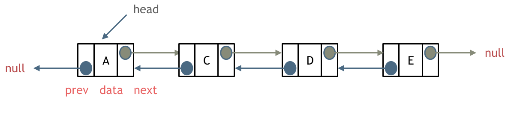
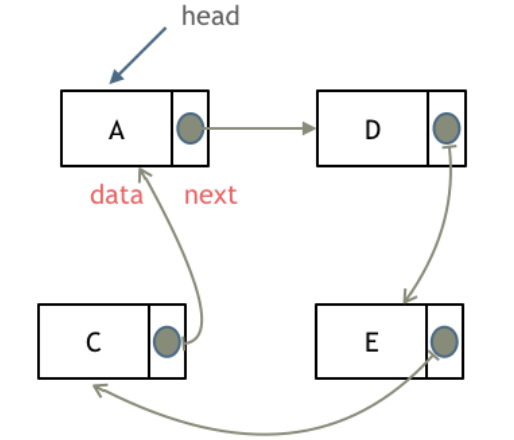
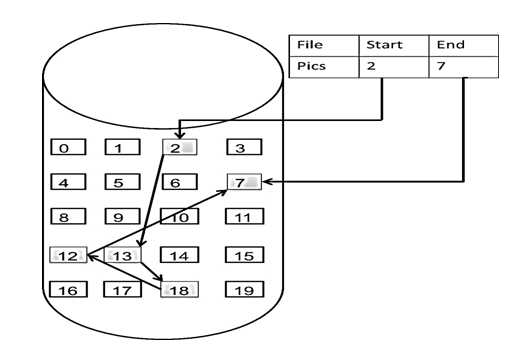

## 链表

### 什么是链表

链表是一种通过**指针**串联在一起的线性结构。每一个节点由两部分组成，一个是数据域，一个是指针域(存放指向下一个节点的指针)。最后一个节点的指针域指向null。

链表的入口节点称为列表的头节点，也就是head。


### 链表类型

#### 单链表


#### 双链表

单链表中的节点只有一个指针域，指向下一个节点。

双链表的每个节点有**两个指针域**，一个指向下一个节点，一个指向上一个节点。

优点：既可以前查询，又可以后查询。



#### 循环链表

循环链表，就是链表首尾相连。循环链表可以用来解决 约瑟夫环 问题。



### 链表的存储方式

数组在内存中是连续分布的，但是链表在内存中不是连续分布的。

链表是通过指针域的指针 链接在内存中的各个节点。所以链表中的节点是散乱分布在内存中的某地址上，分配的机制取决于系统的内存管理。



### 链表的定义

```
public class ListNode {
	int val; // 节点上存储的元素
	ListNode next; // 指向下一个节点的指针
	ListNode(int val) { // 构造函数
		this.val = val;
	}
}
```

### 链表的操作

#### 删除节点

删除节点只要将上一个节点C的 next 指针，指向下一个节点 E 即可。


#### 添加节点


可以看出链表的增添和删除都是O(1)操作，也不会影响到其他节点。

但是要注意，要是删除第五个节点，需要从头节点查找到第四个节点通过 next 指针进行删除操作，查找的时间复杂度是O(n)。

### 性能分析

|      | 插入/删除时间复杂度 | 查询时间复杂度 | 适用场景                         |
| ---- | ------------------- | -------------- | -------------------------------- |
| 数组 | O(n)                | O(1)           | 数据量固定，频繁查询，较少增删   |
| 链表 | O(1)                | O(n)           | 数据量不固定，频繁增删，较少查询 |

