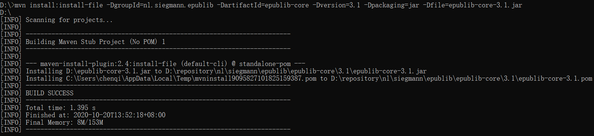
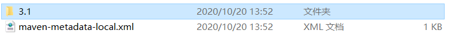
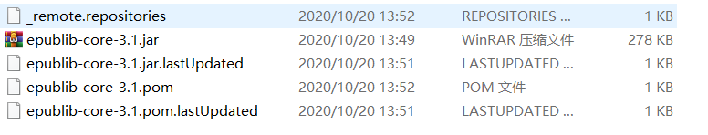

### 将jar包打入本地仓库

**命令：**

` mvn install:install-file -DgroupId=nl.siegmann.epublib -DartifactId=epublib-core -Dversion=3.1 -Dpackaging=jar -Dfile=epublib-core-3.1.jar` 

相当于在pom.xml中写

```
<dependency>
	<groupId>nl.siegmann.epublib</groupId>
	<artificatId>epublib-core</artificatId>
	<version>3.1</version>
</dependency>

```




在到本地仓库中就能看到






 

